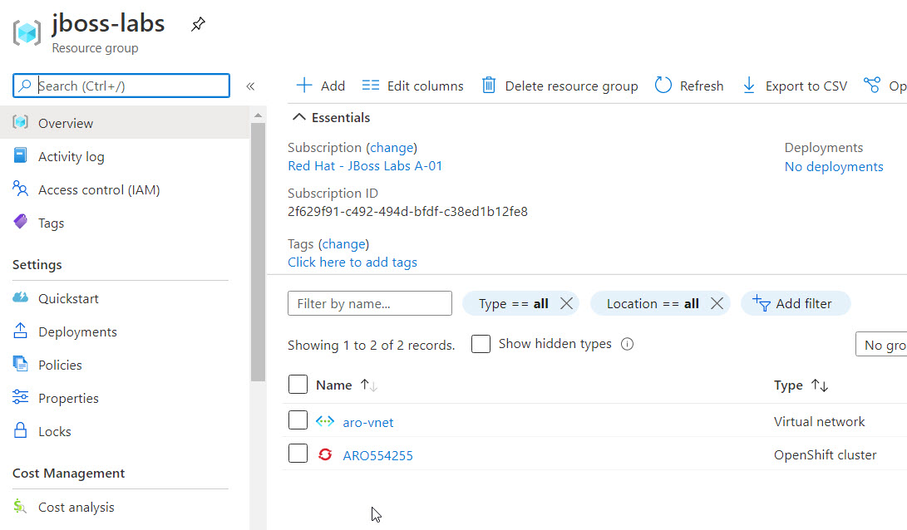
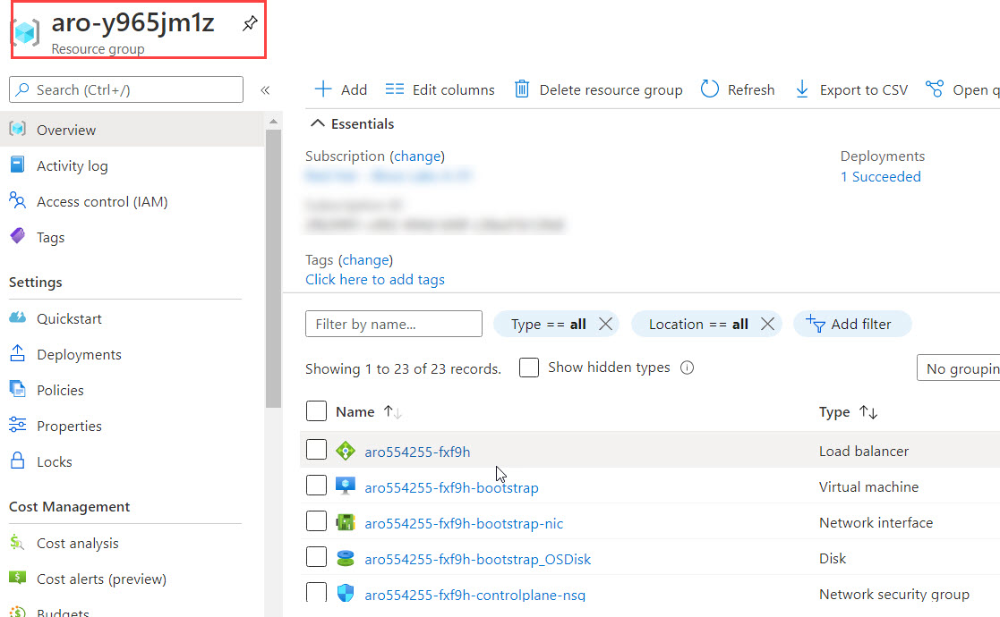
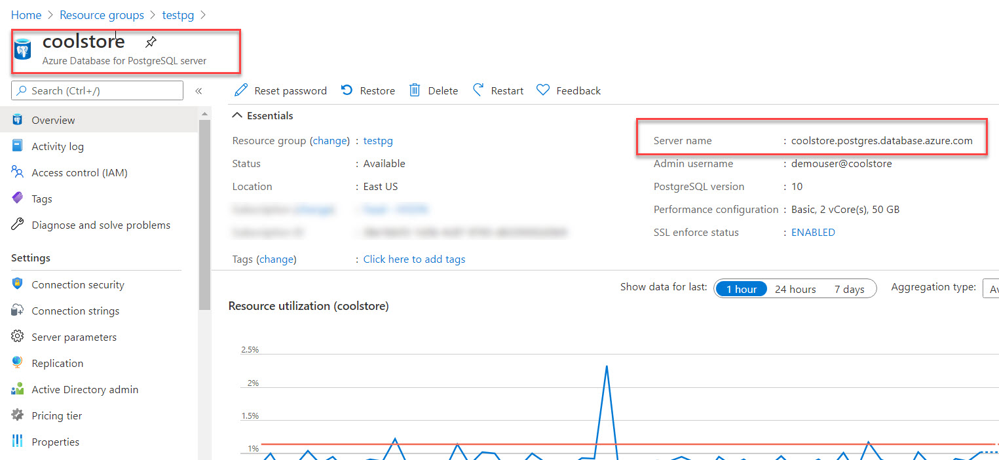
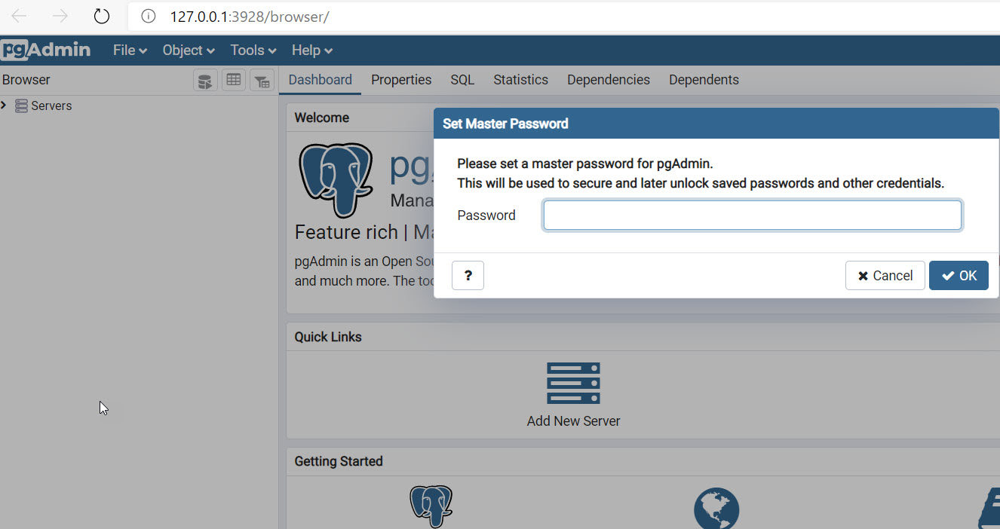
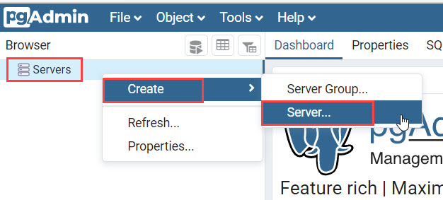
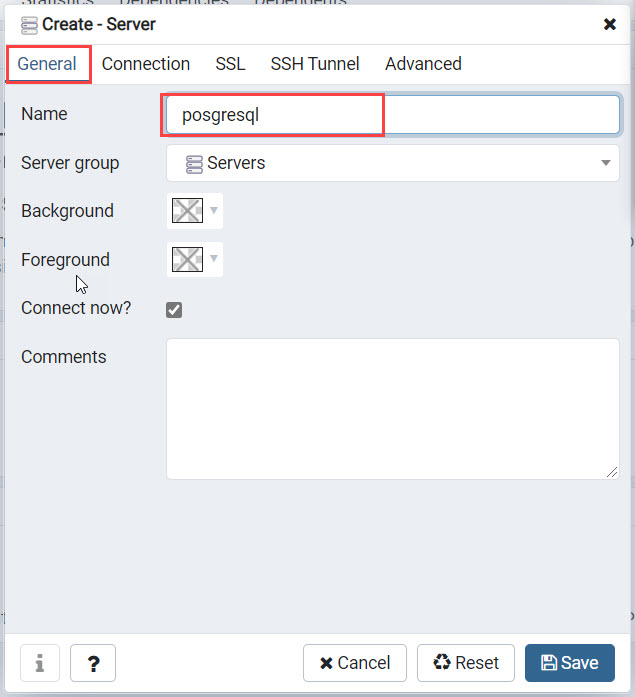
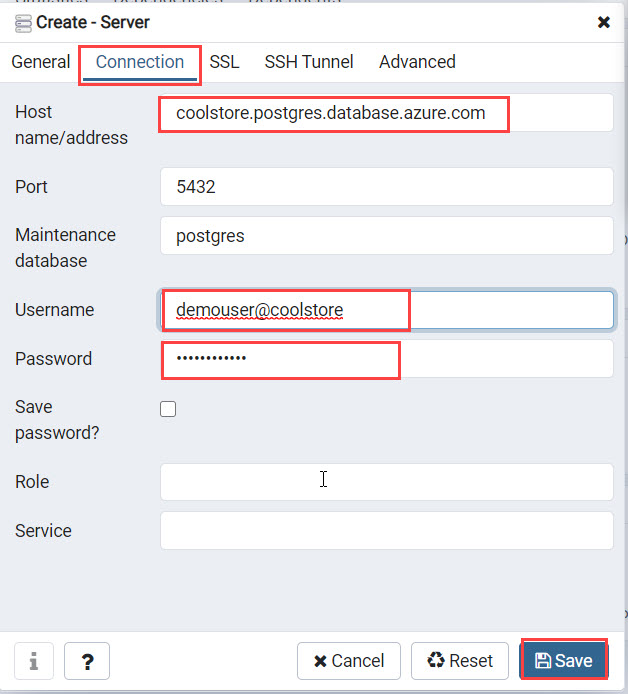
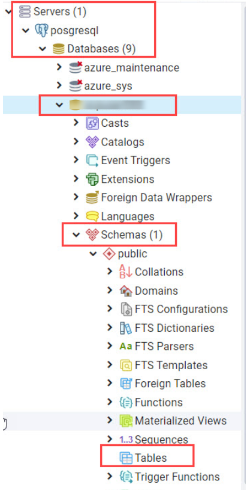
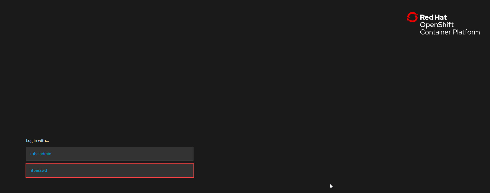
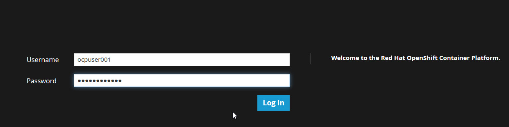

# Getting Started
## Validate your Azure Environment

Azure Red Hat OpenShift provides a flexible, self-service deployment of fully managed OpenShift clusters. Maintain regulatory compliance and focus on your application development, while your master, infrastructure and application nodes are patched, updated and monitored by both Microsoft and Red Hat. Choose your own registry, networking, storage or CI/CD solutions.
We are using a pre-created Azure Red Hat OpenShift cluster in this lab.

### Login to Azure

Navigate to https://portal.azure.com. Login using the Azure Username and Password provided in the lab enviornment details page. Select `Resource groups` to see all the Resource groups in the subscription

Open `Jboss-labs` resource group to see the pre-created OpenShift Cluster. You can see a Virtual Network and an Openshift cluster in this Resource group.

Azure RedHat OpenShift has a couple of other related resources deployed in resourse. To see all the related resources open resource group with prefix `aro` (aro-XXXXXX)
You can explore through all the resources available here. You can also see the Master and Worker nodes created.

We are also using an Azure PostgreSQL Database in this lab. Please open `PostgreSQL` resources group to access the PostgreSQL Database.

Open the PostgreSQL Database to see the Host name/Server name.

Username and password of the Azure Postgre SQL Database are provided in the environment details page.

To access PostgreSQL database, you need to install `PGAdmin` in your local machine (https://www.pgadmin.org/download/). Open the `PGAdmin` app, it will get open up in the default browser of your system.

PGAdmin may ask to set a master password while opening for the first time. Provide any password.

For connecting to our Azure PostgreSQL Database, Right Click on `Server`, select `Create` and then select `Server`.

In the new window that appear, provide a name for the connection.

Then Select Connection tab and provide HostName , Username and Password.All these values will be available in the environment details page.

Once you successfully connected to the database, Expand `Databases` to see the database already created for you. The database name will be same as that of you OpenShift Username (for example : OCPUSER0XX). Now expand your database, Schemas and Tables. There won't be any tables availabe yet. We will create tables in Second and Third Exercise.

## Getting Started with OpenShift

In this lab you will get familiar with the OpenShift CLI and OpenShift Web Console and get ready for the Application Modernization labs.

For completing the following labs, you can either use your own workstation or as an
alternative, CodeReady Workspaces web IDE. The advantage of your own workstation is that you use the
environment that you are familiar with while the advantage of CodeReady Workspaces is that all
tools needed (Maven, Git, OpenShift CLI, etc ) are pre-installed in it (not on your workstation!) and all interactions
takes place within the browser which removes possible internet speed issues and version incompatibilities
on your workstation.

The choice is yours but whatever you pick, like most things in life, stick with it for all the labs. We
ourselves are in love with CodeReady Workspaces and highly recommend it.

## Login to OpenShift web console

OpenShift ships with a web-based console that will allow users to
perform various tasks via a browser.  To get a feel for how the web console
works, open your browser and go to the **OpenShift Web Console url** provided in the environment details page.

The first screen you will see is the authentication screen. Select **htpasswd** option and enter your **OpenShift username** and **password**.

CodeReady Workspaces and your deployment environment, both, run on this OpenShift cluster.

= What is Quarkus?
:experimental:
:imagesdir: images

image::logo.png[quarkus-logo, 900]

Quarkus is a Kubernetes Native Java stack tailored for GraalVM & OpenJDK HotSpot, crafted from the best of breed Java libraries and standards. Amazingly fast boot time, incredibly low RSS memory (not just heap size!) offering near instant scale up and high density memory utilization in container orchestration platforms like Kubernetes. Quarkus uses a technique called https://quarkus.io/vision/container-first[compile time boot^] and offers a unified imperative and reactive programming model and a number of other developer features like Live Reload to bring _real joy_ to your development.

*Red Hat* offers the fully supported https://access.redhat.com/products/quarkus[Red Hat Build of Quarkus(RHBQ)^] with support and maintenance of Quarkus. In this workhop, you will use Quarkus to develop Kubernetes-native microservices and deploy them to OpenShift. Quarkus is one of the runtimes included in https://www.redhat.com/en/products/runtimes[Red Hat Runtimes^]. https://access.redhat.com/documentation/en-us/red_hat_build_of_quarkus[Learn more about RHBQ^].

Throughout this lab you'll discover how Quarkus can make your development of cloud native apps faster and more productive.

== First Step: Set Your Username!

Look in the box at the top of your screen. Is your username set already? If so it will look like this:

image::alreadyset.png[Set User ID above, 700]

If your username is properly set, then you can move on. **If not, in the above box, enter the user ID you were assigned** like this:

image::setuser.png[Set User ID above, 700]

This will customize the links and copy/paste code for this workshop. If you accidently type the wrong username, just click the green recycle icon to reset it.

== Click-to-Copy

You will see various code and command blocks throughout these exercises which can be copy/pasted directly by clicking anywhere on the block of text:

[source,java,role="copypaste"]
----
/* A sample Java snippet that you can copy/paste by clicking */
public class CopyMeDirectly {
    public static void main(String[] args) {
        System.out.println("You can copy this whole class with a click!");
    }
}
----

Simply click once and the whole block is copied to your clipboard, ready to be pasted with kbd:[CTRL+V] (or kbd:[Command+V] on Mac OS).

There are also Linux shell commands that can also be copied and pasted into a Terminal in your Development Environment:

[source,sh,role="copypaste"]
----
echo "This is a bash shell command that you can copy/paste by clicking"
----

## Access Your Development Environment

You will be using Red Hat CodeReady Workspaces, an online IDE based on https://www.eclipse.org/che/[CodeReady Workspaces^]. **Changes to files are auto-saved every few seconds**, so you don't need to explicitly save changes.

To get started, {{ CHE_URL }}[access the CodeReady Workspaces instance^] and log in using the username and password you've been assigned:

* *Username*: `{{ USER_ID }}`
* *Password*: `{{ CHE_USER_PASSWORD }}`

image::che-login.png[login,400]

Once you log in, you'll be placed on your personal dashboard. We've pre-created workspaces for you to use. Click on the name of the pre-created workspace on the left, as shown below (the name will be different depending on your assigned number). You can also click on the name of the workspace in the center, and then click on the green button that says "OPEN" on the top right hand side of the screen:

image::che-precreated.png[precreated,800]

After a minute or two, you'll be placed in the workspace:

image::che-workspace.png[workspace,800]

Users of Eclipse, IntelliJ IDEA or Visual Studio Code will see a familiar layout: a project/file browser on the left, a code editor on the right, and a terminal at the bottom. You'll use all of these during the course of this workshop, so keep this browser tab open throughout. **If things get weird, you can simply reload the browser tab to refresh the view.**

Ready? Let's go!
